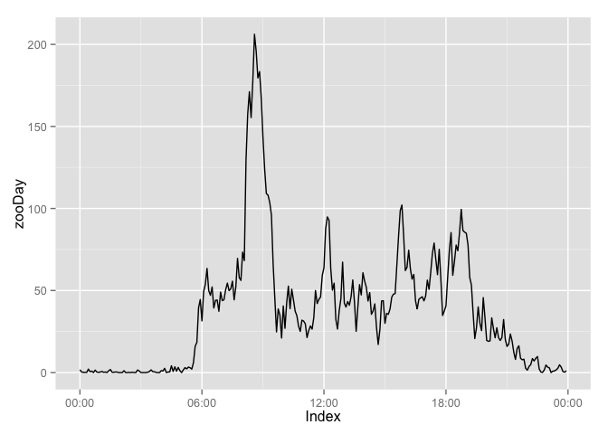
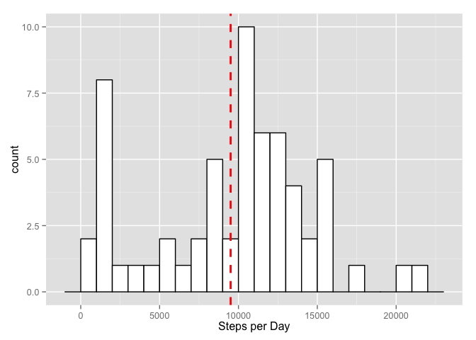
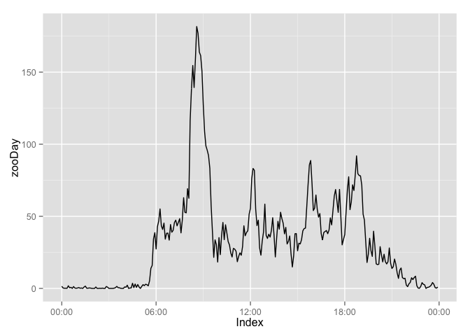
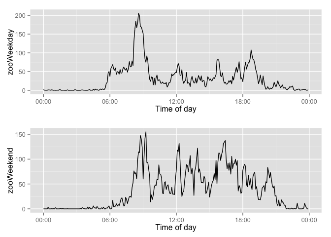

# Reproducible Research: Peer Assessment 1

## Introduction

In this short note we will be analysing activity levels during the day. The data we will study is collected from a personal movement activity monitoring device. It consists of number of steps taken during  five minutes periods in the period from 1. October 2012 until 29. November 2012. Unfortunately the dataset contains some missing values. We will start by defining som utility functions and load some libraries that will be needed. After this we continue by reading in the raw data from the net and manipulate it. Our main objective will be to generate a true time variable from the recorded intervals. In the start we will just ignore the missing values. Later on we will impute the missing values by the median number of steps per interval. At the end of the note we will study whether activity levels is different in the weekends.

## Some utility functions and libraries needed

We start by defining two utilty functions and load som R packages. 


```r
# Function to read ziped files. Solution due to Jack Wasey at Stackoverflow
# In thread http://stackoverflow.com/questions/8986818/automate-zip-file-reading-in-r
read.zip.url <- function(url, filename = NULL, FUN = readLines, ...) {
  zipfile <- tempfile()
#  download.file(url = url, destfile = zipfile, quiet = TRUE)
# small hack to support https
download.file(url = url, destfile = zipfile, quiet = TRUE, method="curl")
zipdir <- tempfile()
  dir.create(zipdir)
  unzip(zipfile, exdir = zipdir) # files="" so extract all
  files <- list.files(zipdir)
  if (is.null(filename)) {
    if (length(files) == 1) {
      filename <- files
    } else {
      stop("multiple files in zip, but no filename specified: ", paste(files, collapse = ", "))
    }
  } else { # filename specified
    stopifnot(length(filename) ==1)
    stopifnot(filename %in% files)
  }
  file <- paste(zipdir, files[1], sep="/")
  do.call(FUN, args = c(list(file.path(zipdir, filename)), list(...)))
}

# Taken from http://www.cookbook-r.com/Graphs/Multiple_graphs_on_one_page_(ggplot2)/
# Multiple plot function
#
# ggplot objects can be passed in ..., or to plotlist (as a list of ggplot objects)
# - cols:   Number of columns in layout
# - layout: A matrix specifying the layout. If present, 'cols' is ignored.
#
# If the layout is something like matrix(c(1,2,3,3), nrow=2, byrow=TRUE),
# then plot 1 will go in the upper left, 2 will go in the upper right, and
# 3 will go all the way across the bottom.
#
multiplot <- function(..., plotlist=NULL, file, cols=1, layout=NULL) {
        require(grid)
        
        # Make a list from the ... arguments and plotlist
        plots <- c(list(...), plotlist)
        
        numPlots = length(plots)
        
        # If layout is NULL, then use 'cols' to determine layout
        if (is.null(layout)) {
                # Make the panel
                # ncol: Number of columns of plots
                # nrow: Number of rows needed, calculated from # of cols
                layout <- matrix(seq(1, cols * ceiling(numPlots/cols)),
                                 ncol = cols, nrow = ceiling(numPlots/cols))
        }
        
        if (numPlots==1) {
                print(plots[[1]])
                
        } else {
                # Set up the page
                grid.newpage()
                pushViewport(viewport(layout = grid.layout(nrow(layout), ncol(layout))))
                
                # Make each plot, in the correct location
                for (i in 1:numPlots) {
                        # Get the i,j matrix positions of the regions that contain this subplot
                        matchidx <- as.data.frame(which(layout == i, arr.ind = TRUE))
                        
                        print(plots[[i]], vp = viewport(layout.pos.row = matchidx$row,
                                                        layout.pos.col = matchidx$col))
                }
        }
}
```

Then we load some packages.


```r
# Loads different needed libraries. Strategy is to put the steps into a zoo object. And than use functions from zoo and xts to aggregate on time intervals.
library(zoo)
```

```
## 
## Attaching package: 'zoo'
## 
## The following objects are masked from 'package:base':
## 
##     as.Date, as.Date.numeric
```

```r
library(xts)
library(ggplot2)
library(scales)
library(knitr)
```


## Loading and preprocessing the data

The data for this assignment is provided as a zipped .csv file. To read the data into R we could first unzip the file in a UNIX terminal and then read the file with the **read.csv()** function, but would be even nicer to have a general solution to read at zipped file directly into R. A quick search turned up the following solution on Stackoverflow (http://stackoverflow.com/questions/8986818/automate-zip-file-reading-in-r) due to Jack Wasey. This file ought to be read in from the net and not from local disk, since this is meant to be reproducible research. It turned out to be problematic to read in the zipped file from the rdpeng git repository so instead we choose to download directly from the source archive at **cloudfront.net** via the **http** protocol.


```r
#Set wd to local git directory  
#setwd('mywd')
# Problem downloading activity.zip from rdpeng github repository using https
# Worked round going directly to source via http
zipUrl <- "http://d396qusza40orc.cloudfront.net/repdata%2Fdata%2Factivity.zip"
# Use utility function defined above to read in the ziped file
myData <- read.zip.url(zipUrl, filename="activity.csv",FUN=read.csv, header=TRUE)
#head(myData,n=10)
# uncomment next line to save data to local working directory
#save(myData,file="myData.RData")
# Save myData to local working directory and then load it. 
# Comment out the functions above when working but uncomment before final commit so that reproducable
# Seems a waste of bandwidth to load the dataset from the net every time we do Knit HTML
# Uncomment next line to load data from local working directory
#load("myData.RData")
#check class
class(myData)
```

```
## [1] "data.frame"
```

```r
names(myData)
```

```
## [1] "steps"    "date"     "interval"
```

The function **read.csv()** is doing some magic reading in the variables. We start by checking what class they are. 


```r
class(myData$steps)
```

```
## [1] "integer"
```

```r
class(myData$date)
```

```
## [1] "factor"
```

```r
class(myData$interval)
```

```
## [1] "integer"
```

It looks like it might be convenient to have the data as a time series object. Hence we convert the interval variable to a **POSIXct** object called time. This will be time since midnight. This variable is then pasted together with the date variable to obtain a variable dateTime that ought to give a unique point in time. We put the **steps** and **dataTime** variables into a **zoo** object.


```r
# generate time from interval
# pads interval with zeros
myData$intervalPadded <- formatC(myData$interval, width = 4, format = "d", flag = "0")
#add 2 zeros at the end for seconds
myData$intervalPadded <- paste(myData$intervalPadded,"00",sep="")
# Our intervals are a kind of time. Mend them so that we can convert to POSIXct and later a zoo object
myData$time <- paste(substr(myData$intervalPadded,1,2),substr(myData$intervalPadded,3,4),substr(myData$intervalPadded,5,6),sep=":")
myData$dateTime <- as.POSIXct(strptime(paste(myData$date,myData$time), "%Y-%m-%d %H:%M:%S"), , tz="UCT")
StepsZoo <- zoo(myData$steps,order.by=myData$dateTime)
```


## What is mean total number of steps taken per day?

The number of steps is now put into a zoo object. We can now use functions from the **xts** package to aggregate for different time intervals. It is also easy to make plots of the time series.


```r
# Starts with a rough plot of the timeseries
autoplot(StepsZoo)
```

```
## Warning: Removed 576 rows containing missing values (geom_path).
```

 

Since the data now is a zoo object we can use the **apply.daily()** function from the **xts** package to calculate the total number of steps per day. The results are reported in the table below.

<table>
<caption>Sum of steps recorded for each date. Starting Oct. 1 and ending Nov. 29.</caption>
 <thead>
  <tr>
   <th style="text-align:center;">  Date </th>
   <th style="text-align:center;"> SumSteps  </th>
   <th style="text-align:center;">  Date </th>
   <th style="text-align:center;"> SumSteps  </th>
   <th style="text-align:center;">  Date </th>
   <th style="text-align:center;"> SumSteps  </th>
   <th style="text-align:center;">  Date </th>
   <th style="text-align:center;"> SumSteps  </th>
   <th style="text-align:center;">  Date </th>
   <th style="text-align:center;"> SumSteps  </th>
   <th style="text-align:center;">  Date </th>
   <th style="text-align:center;"> SumSteps  </th>
  </tr>
 </thead>
<tbody>
  <tr>
   <td style="text-align:center;"> 10-01 </td>
   <td style="text-align:center;"> NA </td>
   <td style="text-align:center;"> 10-11 </td>
   <td style="text-align:center;"> 10304 </td>
   <td style="text-align:center;"> 10-21 </td>
   <td style="text-align:center;"> 8821 </td>
   <td style="text-align:center;"> 10-31 </td>
   <td style="text-align:center;"> 15414 </td>
   <td style="text-align:center;"> 11-10 </td>
   <td style="text-align:center;"> NA </td>
   <td style="text-align:center;"> 11-20 </td>
   <td style="text-align:center;"> 4472 </td>
  </tr>
  <tr>
   <td style="text-align:center;"> 10-02 </td>
   <td style="text-align:center;"> 126 </td>
   <td style="text-align:center;"> 10-12 </td>
   <td style="text-align:center;"> 17382 </td>
   <td style="text-align:center;"> 10-22 </td>
   <td style="text-align:center;"> 13460 </td>
   <td style="text-align:center;"> 11-01 </td>
   <td style="text-align:center;"> NA </td>
   <td style="text-align:center;"> 11-11 </td>
   <td style="text-align:center;"> 12608 </td>
   <td style="text-align:center;"> 11-21 </td>
   <td style="text-align:center;"> 12787 </td>
  </tr>
  <tr>
   <td style="text-align:center;"> 10-03 </td>
   <td style="text-align:center;"> 11352 </td>
   <td style="text-align:center;"> 10-13 </td>
   <td style="text-align:center;"> 12426 </td>
   <td style="text-align:center;"> 10-23 </td>
   <td style="text-align:center;"> 8918 </td>
   <td style="text-align:center;"> 11-02 </td>
   <td style="text-align:center;"> 10600 </td>
   <td style="text-align:center;"> 11-12 </td>
   <td style="text-align:center;"> 10765 </td>
   <td style="text-align:center;"> 11-22 </td>
   <td style="text-align:center;"> 20427 </td>
  </tr>
  <tr>
   <td style="text-align:center;"> 10-04 </td>
   <td style="text-align:center;"> 12116 </td>
   <td style="text-align:center;"> 10-14 </td>
   <td style="text-align:center;"> 15098 </td>
   <td style="text-align:center;"> 10-24 </td>
   <td style="text-align:center;"> 8355 </td>
   <td style="text-align:center;"> 11-03 </td>
   <td style="text-align:center;"> 10571 </td>
   <td style="text-align:center;"> 11-13 </td>
   <td style="text-align:center;"> 7336 </td>
   <td style="text-align:center;"> 11-23 </td>
   <td style="text-align:center;"> 21194 </td>
  </tr>
  <tr>
   <td style="text-align:center;"> 10-05 </td>
   <td style="text-align:center;"> 13294 </td>
   <td style="text-align:center;"> 10-15 </td>
   <td style="text-align:center;"> 10139 </td>
   <td style="text-align:center;"> 10-25 </td>
   <td style="text-align:center;"> 2492 </td>
   <td style="text-align:center;"> 11-04 </td>
   <td style="text-align:center;"> NA </td>
   <td style="text-align:center;"> 11-14 </td>
   <td style="text-align:center;"> NA </td>
   <td style="text-align:center;"> 11-24 </td>
   <td style="text-align:center;"> 14478 </td>
  </tr>
  <tr>
   <td style="text-align:center;"> 10-06 </td>
   <td style="text-align:center;"> 15420 </td>
   <td style="text-align:center;"> 10-16 </td>
   <td style="text-align:center;"> 15084 </td>
   <td style="text-align:center;"> 10-26 </td>
   <td style="text-align:center;"> 6778 </td>
   <td style="text-align:center;"> 11-05 </td>
   <td style="text-align:center;"> 10439 </td>
   <td style="text-align:center;"> 11-15 </td>
   <td style="text-align:center;"> 41 </td>
   <td style="text-align:center;"> 11-25 </td>
   <td style="text-align:center;"> 11834 </td>
  </tr>
  <tr>
   <td style="text-align:center;"> 10-07 </td>
   <td style="text-align:center;"> 11015 </td>
   <td style="text-align:center;"> 10-17 </td>
   <td style="text-align:center;"> 13452 </td>
   <td style="text-align:center;"> 10-27 </td>
   <td style="text-align:center;"> 10119 </td>
   <td style="text-align:center;"> 11-06 </td>
   <td style="text-align:center;"> 8334 </td>
   <td style="text-align:center;"> 11-16 </td>
   <td style="text-align:center;"> 5441 </td>
   <td style="text-align:center;"> 11-26 </td>
   <td style="text-align:center;"> 11162 </td>
  </tr>
  <tr>
   <td style="text-align:center;"> 10-08 </td>
   <td style="text-align:center;"> NA </td>
   <td style="text-align:center;"> 10-18 </td>
   <td style="text-align:center;"> 10056 </td>
   <td style="text-align:center;"> 10-28 </td>
   <td style="text-align:center;"> 11458 </td>
   <td style="text-align:center;"> 11-07 </td>
   <td style="text-align:center;"> 12883 </td>
   <td style="text-align:center;"> 11-17 </td>
   <td style="text-align:center;"> 14339 </td>
   <td style="text-align:center;"> 11-27 </td>
   <td style="text-align:center;"> 13646 </td>
  </tr>
  <tr>
   <td style="text-align:center;"> 10-09 </td>
   <td style="text-align:center;"> 12811 </td>
   <td style="text-align:center;"> 10-19 </td>
   <td style="text-align:center;"> 11829 </td>
   <td style="text-align:center;"> 10-29 </td>
   <td style="text-align:center;"> 5018 </td>
   <td style="text-align:center;"> 11-08 </td>
   <td style="text-align:center;"> 3219 </td>
   <td style="text-align:center;"> 11-18 </td>
   <td style="text-align:center;"> 15110 </td>
   <td style="text-align:center;"> 11-28 </td>
   <td style="text-align:center;"> 10183 </td>
  </tr>
  <tr>
   <td style="text-align:center;"> 10-10 </td>
   <td style="text-align:center;"> 9900 </td>
   <td style="text-align:center;"> 10-20 </td>
   <td style="text-align:center;"> 10395 </td>
   <td style="text-align:center;"> 10-30 </td>
   <td style="text-align:center;"> 9819 </td>
   <td style="text-align:center;"> 11-09 </td>
   <td style="text-align:center;"> NA </td>
   <td style="text-align:center;"> 11-19 </td>
   <td style="text-align:center;"> 8841 </td>
   <td style="text-align:center;"> 11-29 </td>
   <td style="text-align:center;"> 7047 </td>
  </tr>
</tbody>
</table>

It is also of interest to see how number of steps per day vary over time. Missing data is just ignored.


```r
#plot of steps per day
plot(apply.daily(StepsZoo,sum), xlab="Date",ylab="Number of Steps")
```

 

Next we study the distribution of steps per day using a histogram. 


```r
tmp <- as.data.frame(apply.daily(StepsZoo,sum))
names(tmp) <- "StepsPerDay"
ggplot(tmp, aes(x=tmp$StepsPerDay)) + geom_histogram(binwidth=1000, colour="black", fill="white") +
    geom_vline(aes(xintercept=mean(tmp$StepsPerDay, na.rm=T)) , color="red", linetype="dashed", size=1) + 
        xlab("Steps per Day")
```

 

```r
rm(tmp)
```

Finally we report the mean and median of steps taken per day. Again we use the **apply.daily()** aggregation function from the **xts** package. The **median** is included in Tukey's five number summary so we use the **fivenum** function from the **stats** package. In addition we need the **mean** 


```r
# Ignore missing values
# fivenum, including  mean and median
tmp <- as.data.frame(apply.daily(StepsZoo,sum))
rownames(tmp) <- NULL
names(tmp) <- "StepsPerDay"
kable(cbind(t(as.data.frame(fivenum(tmp$StepsPerDay, na.rm=TRUE))),mean(tmp$StepsPerDay, na.rm=TRUE)), col.names=c("minimum", "lower-hinge", "median", "upper-hinge", "maximum", "mean"),row.names=FALSE,caption="Tukey five number summary and sample mean.")
```


Table: Tukey five number summary and sample mean.

 minimum   lower-hinge   median   upper-hinge   maximum       mean
--------  ------------  -------  ------------  --------  ---------
      41          8841    10765         13294     21194   10766.19

```r
rm(tmp)
```

## What is the average daily activity pattern?

To find the average daily activity pattern we have to aggregate over the 5 minute intervals across days. This should be possible to accomplish by manipulating the zoo object, but we choose to do it with the help of the **aggregate()** function from the **stats** package. We the manipulate the interval variable in the same way as above to generate a time variable. This is then put into a new zoo object that contains the averages for each 5 minutes interval during the day. This object is then plotted and we also find the interval with the largest activity measured by number of steps.


```r
tmp <- aggregate(myData$steps, by=list(myData$interval), FUN=mean, na.rm=TRUE)
names(tmp) <- c("interval", "meanSteps")
tmp$intervalPadded <- formatC(tmp$interval, width = 4, format = "d", flag = "0")
#add 2 zeros at the end for seconds
#myData$intervalPadded <- paste(myData$intervalPadded,"00",sep="")
#head(tmp$intervalPadded)
# Our intervals are a kind of time. Mend them so that we can convert to POSIXct and later a zoo object
tmp$t <- paste(substr(tmp$intervalPadded,1,2),substr(tmp$intervalPadded,3,4),sep=":")
tmp$time <- as.POSIXct(strptime(tmp$t, "%H:%M") , tz="UCT")
#format(x_formatted, format = "%H:%M")
zooDay <- zoo(tmp$meanSteps, tmp$time)
# Pew, getting rid of the date on the x-axis turned out to be some challenge. Solution: scale package
autoplot(zooDay) + scale_x_datetime(labels = date_format("%H:%M"))
```

 

```r
# The interval with highest activity
tmp[tmp$meanSteps==max(tmp$meanSteps),]
```

```
##     interval meanSteps intervalPadded     t                time
## 104      835  206.1698           0835 08:35 2015-02-15 08:35:00
```

```r
rm(tmp)
```

As seen from both the plot and code above the interval that has the most steps on average is from 8:30 to 8:35.

## Imputing missing values

We start by finding how many complete and incomplete observations we got.


```r
table(complete.cases(myData[,1:3]))
```

```
## 
## FALSE  TRUE 
##  2304 15264
```

As seen from the table we have 2304 incomplete cases and 15264 complete cases. Our strategy for imputing the missing values is to relpace them with the median number of steps for the respective interval. We start by generating a dataframe of the median number of steps per interval. Then for each missing value we find a matching median value in this dataframe.


```r
# Imputing with median
tmp <- aggregate(myData$steps, by=list(myData$interval), FUN=median, na.rm=TRUE)
names(tmp) <- c('interval','medSteps')
myData$medSteps <- tmp[match(myData$interval,tmp$interval),"medSteps"] 
newData <- myData
newData$imSteps <- ifelse(is.na(newData$steps),newData$medSteps,newData$steps)
newData <- newData[,c('imSteps','date','interval','dateTime')]
names(newData) <- c('steps','date','interval','dateTime')
table(is.na(newData$steps))
```

```
## 
## FALSE 
## 17568
```

```r
summary(myData[,1:3])
```

```
##      steps                date          interval     
##  Min.   :  0.00   2012-10-01:  288   Min.   :   0.0  
##  1st Qu.:  0.00   2012-10-02:  288   1st Qu.: 588.8  
##  Median :  0.00   2012-10-03:  288   Median :1177.5  
##  Mean   : 37.38   2012-10-04:  288   Mean   :1177.5  
##  3rd Qu.: 12.00   2012-10-05:  288   3rd Qu.:1766.2  
##  Max.   :806.00   2012-10-06:  288   Max.   :2355.0  
##  NA's   :2304     (Other)   :15840
```

```r
summary(newData[,1.3])
```

```
##    Min. 1st Qu.  Median    Mean 3rd Qu.    Max. 
##       0       0       0      33       8     806
```

As we see from the summaries above the mean number of steps declines when we impute the missing values with the median.

We then turn to calculating mean and median steps per day and making a histogram of daily number of steps. This will be the same analysis as above, but now with the imputed dataset.


```r
# generate time from interval
# pads interval with zeros
newData$intervalPadded <- formatC(newData$interval, width = 4, format = "d", flag = "0")
#add 2 zeros at the end for seconds
newData$intervalPadded <- paste(newData$intervalPadded,"00",sep="")
# Our intervals are a kind of time. Mend them so that we can convert to POSIXct and later a zoo object
newData$time <- paste(substr(newData$intervalPadded,1,2),substr(newData$intervalPadded,3,4),substr(newData$intervalPadded,5,6),sep=":")
newData$dateTime <- as.POSIXct(strptime(paste(newData$date,newData$time), "%Y-%m-%d %H:%M:%S"), , tz="UCT")
StepsZoo <- zoo(newData$steps,order.by=newData$dateTime)
```

We the report the number of steps per day in a table.

<table>
<caption>Sum of steps recorded for each date. Starting Oct. 1 and ending Nov. 29. Missing values are imputed with the median for the corresponding interval.</caption>
 <thead>
  <tr>
   <th style="text-align:center;">  Date </th>
   <th style="text-align:center;"> SumSteps  </th>
   <th style="text-align:center;">  Date </th>
   <th style="text-align:center;"> SumSteps  </th>
   <th style="text-align:center;">  Date </th>
   <th style="text-align:center;"> SumSteps  </th>
   <th style="text-align:center;">  Date </th>
   <th style="text-align:center;"> SumSteps  </th>
   <th style="text-align:center;">  Date </th>
   <th style="text-align:center;"> SumSteps  </th>
   <th style="text-align:center;">  Date </th>
   <th style="text-align:center;"> SumSteps  </th>
  </tr>
 </thead>
<tbody>
  <tr>
   <td style="text-align:center;"> 10-01 </td>
   <td style="text-align:center;"> 1141 </td>
   <td style="text-align:center;"> 10-11 </td>
   <td style="text-align:center;"> 10304 </td>
   <td style="text-align:center;"> 10-21 </td>
   <td style="text-align:center;"> 8821 </td>
   <td style="text-align:center;"> 10-31 </td>
   <td style="text-align:center;"> 15414 </td>
   <td style="text-align:center;"> 11-10 </td>
   <td style="text-align:center;"> 1141 </td>
   <td style="text-align:center;"> 11-20 </td>
   <td style="text-align:center;"> 4472 </td>
  </tr>
  <tr>
   <td style="text-align:center;"> 10-02 </td>
   <td style="text-align:center;"> 126 </td>
   <td style="text-align:center;"> 10-12 </td>
   <td style="text-align:center;"> 17382 </td>
   <td style="text-align:center;"> 10-22 </td>
   <td style="text-align:center;"> 13460 </td>
   <td style="text-align:center;"> 11-01 </td>
   <td style="text-align:center;"> 1141 </td>
   <td style="text-align:center;"> 11-11 </td>
   <td style="text-align:center;"> 12608 </td>
   <td style="text-align:center;"> 11-21 </td>
   <td style="text-align:center;"> 12787 </td>
  </tr>
  <tr>
   <td style="text-align:center;"> 10-03 </td>
   <td style="text-align:center;"> 11352 </td>
   <td style="text-align:center;"> 10-13 </td>
   <td style="text-align:center;"> 12426 </td>
   <td style="text-align:center;"> 10-23 </td>
   <td style="text-align:center;"> 8918 </td>
   <td style="text-align:center;"> 11-02 </td>
   <td style="text-align:center;"> 10600 </td>
   <td style="text-align:center;"> 11-12 </td>
   <td style="text-align:center;"> 10765 </td>
   <td style="text-align:center;"> 11-22 </td>
   <td style="text-align:center;"> 20427 </td>
  </tr>
  <tr>
   <td style="text-align:center;"> 10-04 </td>
   <td style="text-align:center;"> 12116 </td>
   <td style="text-align:center;"> 10-14 </td>
   <td style="text-align:center;"> 15098 </td>
   <td style="text-align:center;"> 10-24 </td>
   <td style="text-align:center;"> 8355 </td>
   <td style="text-align:center;"> 11-03 </td>
   <td style="text-align:center;"> 10571 </td>
   <td style="text-align:center;"> 11-13 </td>
   <td style="text-align:center;"> 7336 </td>
   <td style="text-align:center;"> 11-23 </td>
   <td style="text-align:center;"> 21194 </td>
  </tr>
  <tr>
   <td style="text-align:center;"> 10-05 </td>
   <td style="text-align:center;"> 13294 </td>
   <td style="text-align:center;"> 10-15 </td>
   <td style="text-align:center;"> 10139 </td>
   <td style="text-align:center;"> 10-25 </td>
   <td style="text-align:center;"> 2492 </td>
   <td style="text-align:center;"> 11-04 </td>
   <td style="text-align:center;"> 1141 </td>
   <td style="text-align:center;"> 11-14 </td>
   <td style="text-align:center;"> 1141 </td>
   <td style="text-align:center;"> 11-24 </td>
   <td style="text-align:center;"> 14478 </td>
  </tr>
  <tr>
   <td style="text-align:center;"> 10-06 </td>
   <td style="text-align:center;"> 15420 </td>
   <td style="text-align:center;"> 10-16 </td>
   <td style="text-align:center;"> 15084 </td>
   <td style="text-align:center;"> 10-26 </td>
   <td style="text-align:center;"> 6778 </td>
   <td style="text-align:center;"> 11-05 </td>
   <td style="text-align:center;"> 10439 </td>
   <td style="text-align:center;"> 11-15 </td>
   <td style="text-align:center;"> 41 </td>
   <td style="text-align:center;"> 11-25 </td>
   <td style="text-align:center;"> 11834 </td>
  </tr>
  <tr>
   <td style="text-align:center;"> 10-07 </td>
   <td style="text-align:center;"> 11015 </td>
   <td style="text-align:center;"> 10-17 </td>
   <td style="text-align:center;"> 13452 </td>
   <td style="text-align:center;"> 10-27 </td>
   <td style="text-align:center;"> 10119 </td>
   <td style="text-align:center;"> 11-06 </td>
   <td style="text-align:center;"> 8334 </td>
   <td style="text-align:center;"> 11-16 </td>
   <td style="text-align:center;"> 5441 </td>
   <td style="text-align:center;"> 11-26 </td>
   <td style="text-align:center;"> 11162 </td>
  </tr>
  <tr>
   <td style="text-align:center;"> 10-08 </td>
   <td style="text-align:center;"> 1141 </td>
   <td style="text-align:center;"> 10-18 </td>
   <td style="text-align:center;"> 10056 </td>
   <td style="text-align:center;"> 10-28 </td>
   <td style="text-align:center;"> 11458 </td>
   <td style="text-align:center;"> 11-07 </td>
   <td style="text-align:center;"> 12883 </td>
   <td style="text-align:center;"> 11-17 </td>
   <td style="text-align:center;"> 14339 </td>
   <td style="text-align:center;"> 11-27 </td>
   <td style="text-align:center;"> 13646 </td>
  </tr>
  <tr>
   <td style="text-align:center;"> 10-09 </td>
   <td style="text-align:center;"> 12811 </td>
   <td style="text-align:center;"> 10-19 </td>
   <td style="text-align:center;"> 11829 </td>
   <td style="text-align:center;"> 10-29 </td>
   <td style="text-align:center;"> 5018 </td>
   <td style="text-align:center;"> 11-08 </td>
   <td style="text-align:center;"> 3219 </td>
   <td style="text-align:center;"> 11-18 </td>
   <td style="text-align:center;"> 15110 </td>
   <td style="text-align:center;"> 11-28 </td>
   <td style="text-align:center;"> 10183 </td>
  </tr>
  <tr>
   <td style="text-align:center;"> 10-10 </td>
   <td style="text-align:center;"> 9900 </td>
   <td style="text-align:center;"> 10-20 </td>
   <td style="text-align:center;"> 10395 </td>
   <td style="text-align:center;"> 10-30 </td>
   <td style="text-align:center;"> 9819 </td>
   <td style="text-align:center;"> 11-09 </td>
   <td style="text-align:center;"> 1141 </td>
   <td style="text-align:center;"> 11-19 </td>
   <td style="text-align:center;"> 8841 </td>
   <td style="text-align:center;"> 11-29 </td>
   <td style="text-align:center;"> 7047 </td>
  </tr>
</tbody>
</table>

The following figure shows how steps per day varies over time.


```r
#plot of steps per day
plot(apply.daily(StepsZoo,sum), xlab="Date",ylab="Number of Steps")
```

 

The distribution of steps per day after the missing data is imputed with the median value is illustrated with a histogram below.


```r
tmp <- as.data.frame(apply.daily(StepsZoo,sum))
names(tmp) <- "StepsPerDay"
ggplot(tmp, aes(x=tmp$StepsPerDay)) + geom_histogram(binwidth=1000, colour="black", fill="white") +
    geom_vline(aes(xintercept=mean(tmp$StepsPerDay, na.rm=T)) , color="red", linetype="dashed", size=1) + 
        xlab("Steps per Day")
```

 

```r
rm(tmp)
```

The mean and median steps per day after imputing. We are combining this with Tukey's five numbers. 


```r
# fivenum, including  mean and median
tmp <- as.data.frame(apply.daily(StepsZoo,sum))
rownames(tmp) <- NULL
names(tmp) <- "StepsPerDay"
kable(cbind(t(as.data.frame(fivenum(tmp$StepsPerDay, na.rm=TRUE))),mean(tmp$StepsPerDay, na.rm=TRUE)), col.names=c("minimum", "lower-hinge", "median", "upper-hinge", "maximum", "mean"),row.names=FALSE,caption="Tukey five number summary and sample mean.")
```


Table: Tukey five number summary and sample mean.

 minimum   lower-hinge   median   upper-hinge   maximum       mean
--------  ------------  -------  ------------  --------  ---------
      41          6778    10395         12811     21194   9503.869

```r
rm(tmp)
```

And finally we end this section with a plot of the avarage number of step per five minutes period during the day.


```r
tmp <- aggregate(newData$steps, by=list(newData$interval), FUN=mean, na.rm=TRUE)
names(tmp) <- c("interval", "meanSteps")
tmp$intervalPadded <- formatC(tmp$interval, width = 4, format = "d", flag = "0")
# Our intervals are a kind of time. Mend them so that we can convert to POSIXct and later a zoo object
tmp$t <- paste(substr(tmp$intervalPadded,1,2),substr(tmp$intervalPadded,3,4),sep=":")
tmp$time <- as.POSIXct(strptime(tmp$t, "%H:%M") , tz="UCT")
#format(x_formatted, format = "%H:%M")
zooDay <- zoo(tmp$meanSteps, tmp$time)
# Pew, getting rid of the date on the x-axis turned out to be some challenge. Solution: scale package
autoplot(zooDay) + scale_x_datetime(labels = date_format("%H:%M"))
```

 

```r
# The interval with highest activity
tmp[tmp$meanSteps==max(tmp$meanSteps),]
```

```
##     interval meanSteps intervalPadded     t                time
## 104      835   181.623           0835 08:35 2015-02-15 08:35:00
```

```r
rm(tmp)
```

## Are there differences in activity patterns between weekdays and weekends?

To address this question we start by making a factor variable with the two levels "weekday" and "weekend".


```r
newData$wd <- factor(weekdays(as.Date(newData$date)))
newData$wdf <- factor(ifelse(newData$wd %in% c('Saturday', 'Sunday'), 'weekend', 'weekday'))
table(newData$wdf)
```

```
## 
## weekday weekend 
##   12960    4608
```

```r
# Number of days in each category
table(newData$wdf)/288
```

```
## 
## weekday weekend 
##      45      16
```

```r
names(newData)
```

```
## [1] "steps"          "date"           "interval"       "dateTime"      
## [5] "intervalPadded" "time"           "wd"             "wdf"
```

We use this factor variable to split the dataset and again we make a time variable from date and interval. Then we make a two panel plot with the help of **ggplot()** function and the **multiplot** utility function defined in the start of this note.


```r
newDataWD <- subset(newData,newData$wdf=='weekday',select=c('steps','interval'))
newDataWE <- subset(newData,newData$wdf=='weekend',select=c('steps','interval'))
#should be no NA so na.rm=TRUE
tmpWD <- aggregate(newDataWD$steps, by=list(newDataWD$interval), FUN=mean)
tmpWE <- aggregate(newDataWE$steps, by=list(newDataWE$interval), FUN=mean)
#put on names
names(tmpWD) <- c('interval', 'meanSteps')
names(tmpWE) <- c('interval', 'meanSteps')
#pad the iterval with leading zeros
tmpWD$intervalPadded <- formatC(tmpWD$interval, width = 4, format = "d", flag = "0")
tmpWE$intervalPadded <- formatC(tmpWE$interval, width = 4, format = "d", flag = "0")
#make a tmp variable where hour and minutes are seperated by :
tmpWD$t <- paste(substr(tmpWD$intervalPadded,1,2),substr(tmpWD$intervalPadded,3,4),sep=":")
tmpWE$t <- paste(substr(tmpWE$intervalPadded,1,2),substr(tmpWE$intervalPadded,3,4),sep=":")
# convert to a POSIXct object
tmpWD$time <- as.POSIXct(strptime(tmpWD$t, "%H:%M") , tz="UCT")
tmpWE$time <- as.POSIXct(strptime(tmpWE$t, "%H:%M") , tz="UCT")
# make zoo object
zooWeekday <- zoo(tmpWD$meanSteps, tmpWD$time)
zooWeekend <- zoo(tmpWE$meanSteps, tmpWE$time)
# plot with ggplot through autoplot
pwd <- autoplot(zooWeekday) + scale_x_datetime(labels = date_format("%H:%M")) + xlab('Time of day')
pwe <- autoplot(zooWeekend) + scale_x_datetime(labels = date_format("%H:%M")) + xlab('Time of day')
# two panel plot with multiplot. Note time on the axis
multiplot(pwd, pwe, cols=1)
```

```
## Loading required package: grid
```

 

As will be seen from the figure above there seems to be some difference in activity level between weekdays and weekends. There is a greater level of activity during early moring in the weekdays and also a greater peak around 8:30 which is the time of day with the highest level of activity. In addition there seems to be a higher level of activity late in the evening about 20:00 to 22:00 in the weekends.

## Conclusions

As shown in this note this dataset indicates that activity levels varies during the day with a pronounced peak about 8:30 in the morning. In addition there seems to be some difference in activity level between workdays and weekends.
