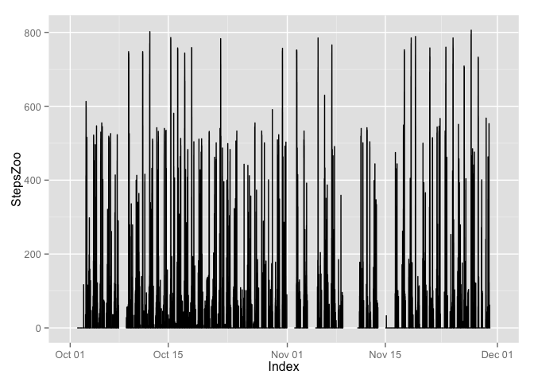
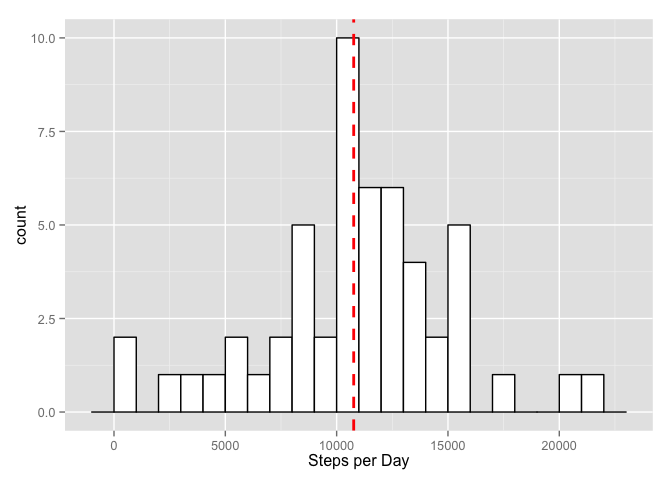

# Reproducible Research: Peer Assessment 1

Just testing first commit.Do we have latex math $y = \sum_{i=1}^n x^i$, Some R-code 


```r
a <- 2
b <- 3
a + b
```

```
## [1] 5
```

New test commit. Had to set up ssh to get push to work from xstudio. I hope it works now.

## Some utility functions and library needed


```r
# Function to read ziped files. Solution due to Jack Wasey at Stackoverflow
# In thread http://stackoverflow.com/questions/8986818/automate-zip-file-reading-in-r
read.zip.url <- function(url, filename = NULL, FUN = readLines, ...) {
  zipfile <- tempfile()
#  download.file(url = url, destfile = zipfile, quiet = TRUE)
# small hack to support https
download.file(url = url, destfile = zipfile, quiet = TRUE, method="curl")
zipdir <- tempfile()
  dir.create(zipdir)
  unzip(zipfile, exdir = zipdir) # files="" so extract all
  files <- list.files(zipdir)
  if (is.null(filename)) {
    if (length(files) == 1) {
      filename <- files
    } else {
      stop("multiple files in zip, but no filename specified: ", paste(files, collapse = ", "))
    }
  } else { # filename specified
    stopifnot(length(filename) ==1)
    stopifnot(filename %in% files)
  }
  file <- paste(zipdir, files[1], sep="/")
  do.call(FUN, args = c(list(file.path(zipdir, filename)), list(...)))
}
# Loads different needed libraries. Strategy is to put the steps into a zoo object. And than use functions from zoo and xts to aggregate on time intervals.
library(zoo)
```

```
## 
## Attaching package: 'zoo'
## 
## The following objects are masked from 'package:base':
## 
##     as.Date, as.Date.numeric
```

```r
library(xts)
library(xtable)
library(ggplot2)
library(knitr)
# loads dplyr also, but perhaps we can make do without this
library(dplyr)
```

```
## 
## Attaching package: 'dplyr'
## 
## The following objects are masked from 'package:xts':
## 
##     first, last
## 
## The following object is masked from 'package:stats':
## 
##     filter
## 
## The following objects are masked from 'package:base':
## 
##     intersect, setdiff, setequal, union
```


## Loading and preprocessing the data

The data for this assigment is provided as a ziped .csv file. To read the data into R we could first unzip the file in a unix terminal and then read the file with the $\texttt{read.csv()}$ function. At the same time it would be nice to have a general solution to read at ziped file directly into R. A quick search turned up the following solution on Stackoverflow (http://stackoverflow.com/questions/8986818/automate-zip-file-reading-in-r) due to Jack Wasey. This file ought to be read in from the net and not from local disk, since this is meant to be reproducible reasearch. It was problematic to read in the zipped file from the rdpeng git repository so we insteaded choose to download directly from the source archive at **cloudfront.net** via the **http** protocol.


```r
#Set wd to local git directory
setwd('/Users/ag/dev/git/RepData_PeerAssessment1')
# Problem downloading activity.zip from rdpeng github repository using https
# Worked round going directly to source via http
#zipUrl <- "http://d396qusza40orc.cloudfront.net/repdata%2Fdata%2Factivity.zip"
# Use utility function defined above to read in the ziped file
#myData <- read.zip.url(zipUrl, filename="activity.csv",FUN=read.csv, header=TRUE)
#head(myData,n=10)
#save(myData,file="myData.RData")
# Save myData to local working directory and then load it. 
# Comment out the functions above when working but uncomment before final commit so that reproducable
# Seems a waste of bandwidth to load the dataset from the net every time we do Knit HTML
load("myData.RData")
#check class
class(myData)
```

```
## [1] "data.frame"
```

```r
names(myData)
```

```
## [1] "steps"    "date"     "interval"
```

The function **read.csv()** is doing som magic reading in the variables. We start by checking what class they are. 


```r
class(myData$steps)
```

```
## [1] "integer"
```

```r
class(myData$date)
```

```
## [1] "factor"
```

```r
class(myData$interval)
```

```
## [1] "integer"
```
It looks like it might be convenient to have the data as a timeseries object too. Hence we convert the interval variable to a **POSIXct** object called time. This will be time since midnight. This variable is then pasted toghether with the date variable to obtain a variable dateTime that ought to give a unique point in time. We put the **steps** and **dataTime** into a **zoo** object.


```r
# generate time from interval
# pads interval with zeros
myData$intervalPadded <- formatC(myData$interval, width = 4, format = "d", flag = "0")
#add 2 zeros at the end for seconds
myData$intervalPadded <- paste(myData$intervalPadded,"00",sep="")
head(myData$intervalPadded)
```

```
## [1] "000000" "000500" "001000" "001500" "002000" "002500"
```

```r
# Nice trix but works with intervals counted from midnight
#myData$time <- format( as.POSIXct(Sys.Date()) + myData$interval*60, format="%H:%M:%S", tz="UCT")
myData$time <- paste(substr(myData$intervalPadded,1,2),substr(myData$intervalPadded,3,4),substr(myData$intervalPadded,5,6),sep=":")
head(myData)
```

```
##   steps       date interval intervalPadded     time
## 1    NA 2012-10-01        0         000000 00:00:00
## 2    NA 2012-10-01        5         000500 00:05:00
## 3    NA 2012-10-01       10         001000 00:10:00
## 4    NA 2012-10-01       15         001500 00:15:00
## 5    NA 2012-10-01       20         002000 00:20:00
## 6    NA 2012-10-01       25         002500 00:25:00
```

```r
myData$dateTime <- as.POSIXct(strptime(paste(myData$date,myData$time), "%Y-%m-%d %H:%M:%S"), , tz="UCT")
head(myData)
```

```
##   steps       date interval intervalPadded     time            dateTime
## 1    NA 2012-10-01        0         000000 00:00:00 2012-10-01 00:00:00
## 2    NA 2012-10-01        5         000500 00:05:00 2012-10-01 00:05:00
## 3    NA 2012-10-01       10         001000 00:10:00 2012-10-01 00:10:00
## 4    NA 2012-10-01       15         001500 00:15:00 2012-10-01 00:15:00
## 5    NA 2012-10-01       20         002000 00:20:00 2012-10-01 00:20:00
## 6    NA 2012-10-01       25         002500 00:25:00 2012-10-01 00:25:00
```

```r
StepsZoo <- zoo(myData$steps,order.by=myData$dateTime)
head(StepsZoo)
```

```
## 2012-10-01 00:00:00 2012-10-01 00:05:00 2012-10-01 00:10:00 
##                  NA                  NA                  NA 
## 2012-10-01 00:15:00 2012-10-01 00:20:00 2012-10-01 00:25:00 
##                  NA                  NA                  NA
```


## What is mean total number of steps taken per day?

The number of steps is now put into a zoo object. We can now use functions from the xts package to aggregate for different time intervals. It is also easy to make plots of the time serie.


```r
# Starts with a rough plot of the timeseries
autoplot(StepsZoo)
```

```
## Warning: Removed 576 rows containing missing values (geom_path).
```

 

Since the data now is a zoo object we can use the **apply.daily()** function from the **xts** package to calculate the total number of steps per day. The results are reported in the table below.

<table>
<caption>Sum of steps recorded for each date. Starting Oct. 1 and ending Nov. 29.</caption>
 <thead>
  <tr>
   <th style="text-align:center;">  Date </th>
   <th style="text-align:center;"> SumSteps  </th>
   <th style="text-align:center;">  Date </th>
   <th style="text-align:center;"> SumSteps  </th>
   <th style="text-align:center;">  Date </th>
   <th style="text-align:center;"> SumSteps  </th>
   <th style="text-align:center;">  Date </th>
   <th style="text-align:center;"> SumSteps  </th>
   <th style="text-align:center;">  Date </th>
   <th style="text-align:center;"> SumSteps  </th>
   <th style="text-align:center;">  Date </th>
   <th style="text-align:center;"> SumSteps  </th>
  </tr>
 </thead>
<tbody>
  <tr>
   <td style="text-align:center;"> 10-01 </td>
   <td style="text-align:center;"> NA </td>
   <td style="text-align:center;"> 10-11 </td>
   <td style="text-align:center;"> 10304 </td>
   <td style="text-align:center;"> 10-21 </td>
   <td style="text-align:center;"> 8821 </td>
   <td style="text-align:center;"> 10-31 </td>
   <td style="text-align:center;"> 15414 </td>
   <td style="text-align:center;"> 11-10 </td>
   <td style="text-align:center;"> NA </td>
   <td style="text-align:center;"> 11-20 </td>
   <td style="text-align:center;"> 4472 </td>
  </tr>
  <tr>
   <td style="text-align:center;"> 10-02 </td>
   <td style="text-align:center;"> 126 </td>
   <td style="text-align:center;"> 10-12 </td>
   <td style="text-align:center;"> 17382 </td>
   <td style="text-align:center;"> 10-22 </td>
   <td style="text-align:center;"> 13460 </td>
   <td style="text-align:center;"> 11-01 </td>
   <td style="text-align:center;"> NA </td>
   <td style="text-align:center;"> 11-11 </td>
   <td style="text-align:center;"> 12608 </td>
   <td style="text-align:center;"> 11-21 </td>
   <td style="text-align:center;"> 12787 </td>
  </tr>
  <tr>
   <td style="text-align:center;"> 10-03 </td>
   <td style="text-align:center;"> 11352 </td>
   <td style="text-align:center;"> 10-13 </td>
   <td style="text-align:center;"> 12426 </td>
   <td style="text-align:center;"> 10-23 </td>
   <td style="text-align:center;"> 8918 </td>
   <td style="text-align:center;"> 11-02 </td>
   <td style="text-align:center;"> 10600 </td>
   <td style="text-align:center;"> 11-12 </td>
   <td style="text-align:center;"> 10765 </td>
   <td style="text-align:center;"> 11-22 </td>
   <td style="text-align:center;"> 20427 </td>
  </tr>
  <tr>
   <td style="text-align:center;"> 10-04 </td>
   <td style="text-align:center;"> 12116 </td>
   <td style="text-align:center;"> 10-14 </td>
   <td style="text-align:center;"> 15098 </td>
   <td style="text-align:center;"> 10-24 </td>
   <td style="text-align:center;"> 8355 </td>
   <td style="text-align:center;"> 11-03 </td>
   <td style="text-align:center;"> 10571 </td>
   <td style="text-align:center;"> 11-13 </td>
   <td style="text-align:center;"> 7336 </td>
   <td style="text-align:center;"> 11-23 </td>
   <td style="text-align:center;"> 21194 </td>
  </tr>
  <tr>
   <td style="text-align:center;"> 10-05 </td>
   <td style="text-align:center;"> 13294 </td>
   <td style="text-align:center;"> 10-15 </td>
   <td style="text-align:center;"> 10139 </td>
   <td style="text-align:center;"> 10-25 </td>
   <td style="text-align:center;"> 2492 </td>
   <td style="text-align:center;"> 11-04 </td>
   <td style="text-align:center;"> NA </td>
   <td style="text-align:center;"> 11-14 </td>
   <td style="text-align:center;"> NA </td>
   <td style="text-align:center;"> 11-24 </td>
   <td style="text-align:center;"> 14478 </td>
  </tr>
  <tr>
   <td style="text-align:center;"> 10-06 </td>
   <td style="text-align:center;"> 15420 </td>
   <td style="text-align:center;"> 10-16 </td>
   <td style="text-align:center;"> 15084 </td>
   <td style="text-align:center;"> 10-26 </td>
   <td style="text-align:center;"> 6778 </td>
   <td style="text-align:center;"> 11-05 </td>
   <td style="text-align:center;"> 10439 </td>
   <td style="text-align:center;"> 11-15 </td>
   <td style="text-align:center;"> 41 </td>
   <td style="text-align:center;"> 11-25 </td>
   <td style="text-align:center;"> 11834 </td>
  </tr>
  <tr>
   <td style="text-align:center;"> 10-07 </td>
   <td style="text-align:center;"> 11015 </td>
   <td style="text-align:center;"> 10-17 </td>
   <td style="text-align:center;"> 13452 </td>
   <td style="text-align:center;"> 10-27 </td>
   <td style="text-align:center;"> 10119 </td>
   <td style="text-align:center;"> 11-06 </td>
   <td style="text-align:center;"> 8334 </td>
   <td style="text-align:center;"> 11-16 </td>
   <td style="text-align:center;"> 5441 </td>
   <td style="text-align:center;"> 11-26 </td>
   <td style="text-align:center;"> 11162 </td>
  </tr>
  <tr>
   <td style="text-align:center;"> 10-08 </td>
   <td style="text-align:center;"> NA </td>
   <td style="text-align:center;"> 10-18 </td>
   <td style="text-align:center;"> 10056 </td>
   <td style="text-align:center;"> 10-28 </td>
   <td style="text-align:center;"> 11458 </td>
   <td style="text-align:center;"> 11-07 </td>
   <td style="text-align:center;"> 12883 </td>
   <td style="text-align:center;"> 11-17 </td>
   <td style="text-align:center;"> 14339 </td>
   <td style="text-align:center;"> 11-27 </td>
   <td style="text-align:center;"> 13646 </td>
  </tr>
  <tr>
   <td style="text-align:center;"> 10-09 </td>
   <td style="text-align:center;"> 12811 </td>
   <td style="text-align:center;"> 10-19 </td>
   <td style="text-align:center;"> 11829 </td>
   <td style="text-align:center;"> 10-29 </td>
   <td style="text-align:center;"> 5018 </td>
   <td style="text-align:center;"> 11-08 </td>
   <td style="text-align:center;"> 3219 </td>
   <td style="text-align:center;"> 11-18 </td>
   <td style="text-align:center;"> 15110 </td>
   <td style="text-align:center;"> 11-28 </td>
   <td style="text-align:center;"> 10183 </td>
  </tr>
  <tr>
   <td style="text-align:center;"> 10-10 </td>
   <td style="text-align:center;"> 9900 </td>
   <td style="text-align:center;"> 10-20 </td>
   <td style="text-align:center;"> 10395 </td>
   <td style="text-align:center;"> 10-30 </td>
   <td style="text-align:center;"> 9819 </td>
   <td style="text-align:center;"> 11-09 </td>
   <td style="text-align:center;"> NA </td>
   <td style="text-align:center;"> 11-19 </td>
   <td style="text-align:center;"> 8841 </td>
   <td style="text-align:center;"> 11-29 </td>
   <td style="text-align:center;"> 7047 </td>
  </tr>
</tbody>
</table>


```r
#plot of steps per day
plot(apply.daily(StepsZoo,sum), xlab="Date",ylab="Number of Steps")
```

 


```r
tmp <- as.data.frame(apply.daily(StepsZoo,sum))
names(tmp) <- "StepsPerDay"
ggplot(tmp, aes(x=tmp$StepsPerDay)) + geom_histogram(binwidth=1000, colour="black", fill="white") +
    geom_vline(aes(xintercept=mean(tmp$StepsPerDay, na.rm=T)) , color="red", linetype="dashed", size=1) + 
        xlab("Steps per Day")
```

 

```r
rm(tmp)
```

Finally we report the mean and median of steps taken per day. Again we use the **apply.daily()** aggregation function from the **xts** package. The **median** is included in Tukey's five number summary so we use the **fivenum** function from the **stats** package. In addition we need the **mean** 


```r
# Ignore missing values
# fivenum, including  mean and median
tmp <- as.data.frame(apply.daily(StepsZoo,sum))
rownames(tmp) <- NULL
names(tmp) <- "StepsPerDay"
kable(cbind(t(as.data.frame(fivenum(tmp$StepsPerDay, na.rm=TRUE))),mean(tmp$StepsPerDay, na.rm=TRUE)), col.names=c("minimum", "lower-hinge", "median", "upper-hinge", "maximum", "mean"),row.names=FALSE,caption="Tukey five number summary and sample mean.")
```


Table: Tukey five number summary and sample mean.

 minimum   lower-hinge   median   upper-hinge   maximum       mean
--------  ------------  -------  ------------  --------  ---------
      41          8841    10765         13294     21194   10766.19

## What is the average daily activity pattern?

Use dplyr to group by interval


```r
#using dplyr. Can probably be deleted now that we have a working zoo object
days <- group_by(myData, as.character(myData$date))
stepsDay <- summarise(days,test=n(),sum(steps))
stepsDay
```

```
## Source: local data frame [61 x 3]
## 
##    as.character(myData$date) test sum(steps)
## 1                 2012-10-01  288         NA
## 2                 2012-10-02  288        126
## 3                 2012-10-03  288      11352
## 4                 2012-10-04  288      12116
## 5                 2012-10-05  288      13294
## 6                 2012-10-06  288      15420
## 7                 2012-10-07  288      11015
## 8                 2012-10-08  288         NA
## 9                 2012-10-09  288      12811
## 10                2012-10-10  288       9900
## ..                       ...  ...        ...
```

```r
head(stepsDay[,3])
```

```
## Source: local data frame [6 x 1]
## 
##   sum(steps)
## 1         NA
## 2        126
## 3      11352
## 4      12116
## 5      13294
## 6      15420
```

```r
#hist(stepsDay[,3],breaks=15)
#mean number of steps per day
#mean(stepsDay[,3], na.rm=TRUE)
#median number of steps per day
#median(stepsDay[,3],na.rm=TRUE)
#myDataNONA <- myData[! is.na(myData$steps),]
#daysInterv <- group_by(myDataNONA, factor(myDataNONA$interval))
#stepsInterval <- summarise(daysInterv,test=n(), sum(steps))
#head(stepsInterval)
#as.numeric(as.character(stepsInterval[,1]))
#plot(as.numeric(as.character(stepsInterval[,1])),stepsInterval[,3], type = "l")
#paste(as.numeric(as.character(stepsInterval[,1])), as.numeric(as.character(stepsInterval[,3])))
#max(stepsInterval[,3])
#stepsInterval[stepsInterval$"sum(steps)"=="10927",]
```


## Imputing missing values


## Are there differences in activity patterns between weekdays and weekends?
